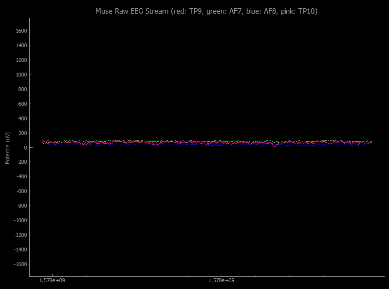

# Muse EEG LSL Tools
Muse EEG LSL Tools is a collection of tools/scripts that enable recording and displaying raw EEG data in real-time. This project uses [pylsl](https://github.com/chkothe/pylsl) to connect to a Muse EEG headband over LSL protocol. For this demo, [BlueMuse](https://github.com/kowalej/BlueMuse) was used, a Windows 10 app that streams data from Muse headset over Bluetooth via LSL (Lab Streaming Layer). Due to BlueMuse, the code does not rely on any specific Bluetooth hardware, and should work with any module supporting BT 4.0. 

The monitor displays real-time raw EEG waveforms at accurate electrical potentials, at maximum frequency supported by the device, with minimal latency. 

EEG to CSV script allow full resolution recording of raw EEG data to a CSV file, for the purposes of performing later analysis of the data. The data is recorded with UNIX timestamps across every row as well as optional marker data which is manually set via left mouse button clicks. In this tool, the electrical potentials are saved at their default relative range of (-1000, 1000), which can be easily converted to uV using the following equation: (x/1000)*3.3*(1/1961)*1000000, where x is the value, 1000 is the range, 3.3 is the voltage and 1961 is the gain of AFE.

## Demo

Displayed electrodes are as follows TP9 (red), AF7 (green), AF8 (blue), TP10 (pink). AUX channel is disabled for this demo.

## Requirements
Assumes installation of Python 3.7 on Windows 10, owning a Muse EEG headband and Bluetooth 4.0 PC module.

To run the tools:
* Get BlueMuse at https://github.com/kowalej/BlueMuse
* pip install -r requirements.txt

## Instructions
* Turn on Muse Headband and set it to pairing mode (do not pair Muse with your Bluetooth module).
* Open BlueMuse, wait for list to update, click on your Muse device and then click `Start Streaming`
* Once Muse headset is online and streaming, in the relevant tool directory run `python main.py`
    * Alternatively, you can make use of ipynb (Jupyter Notebook) versions of the code.
* After use, close the monitor before disconnecting Muse device.

Additionally: by default the monitor displays 4 main electrode channels, to display input from the auxillary channel, you'll need to uncomment lines that mention `AUX`. The EEG to CSV tool will record AUX to a column by default.

## Known Issues
* Resizing the monitor window will introduce delay to data render, restarting the monitor resets it.

## License
The code in this project is licensed under the MIT License. See [LICENSE](LICENSE) for details.
